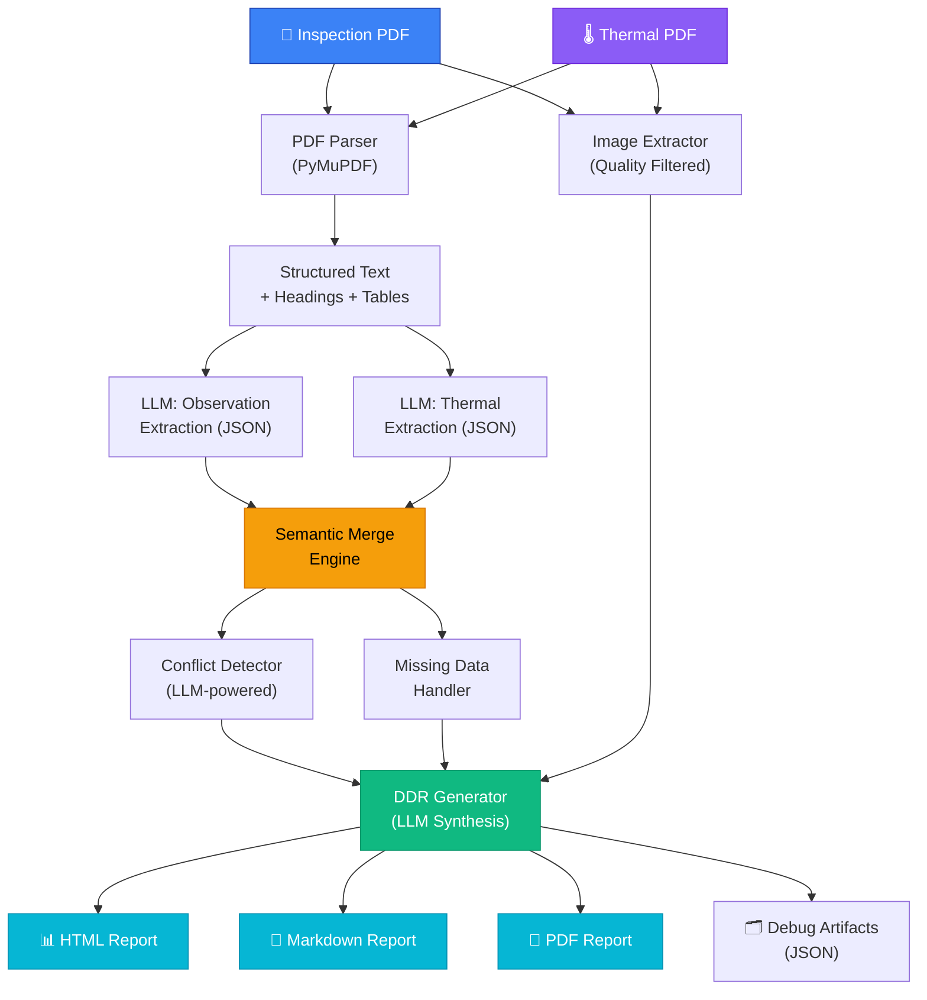

# DDR-AI-Builder

**AI-Powered Detailed Diagnostic Report Generator**

An end-to-end pipeline that ingests Inspection and Thermal PDF reports, extracts structured observations using LLMs, merges findings via semantic similarity, detects conflicts, and generates a professional, client-ready Detailed Diagnostic Report (DDR).

---

## Table of Contents

1. [Project Overview](#1-project-overview)
2. [Problem Statement](#2-problem-statement)
3. [Architecture](#3-architecture)
4. [Workflow Explanation](#4-workflow-explanation)
5. [Technical Design Decisions](#5-technical-design-decisions)
6. [Setup Instructions](#6-setup-instructions)
7. [Usage Examples](#7-usage-examples)
8. [Configuration & Tuning](#8-configuration--tuning)
9. [Validation Strategy](#9-validation-strategy)
10. [System Evaluation Criteria](#10-system-evaluation-criteria)
11. [Limitations](#11-limitations)
12. [Future Improvements](#12-future-improvements)
13. [Sample Outputs](#13-sample-outputs)
14. [Project Structure](#14-project-structure)

---

## 1. Project Overview

DDR-AI-Builder automates the generation of Detailed Diagnostic Reports — a critical deliverable in building inspection workflows. The system replaces hours of manual report compilation by:

- **Parsing** PDF inspection and thermal imaging reports with font-aware structure detection
- **Extracting** structured observations using LLMs (OpenAI GPT-4o / Anthropic Claude / Google Gemini)
- **Merging** findings from both report types using semantic similarity (SentenceTransformers)
- **Detecting** conflicts and missing data between reports
- **Generating** a professional, traceable DDR with source references and confidence scores
- **Exporting** to HTML, Markdown, and PDF formats

The system is accessed via a Streamlit web interface or CLI, and all intermediate pipeline artifacts are persisted for full traceability.

---

## 2. Problem Statement

Building diagnostic reports require integrating findings from multiple data sources — visual inspection reports and thermal imaging surveys. Manually correlating these sources is:

- **Time-consuming**: A single DDR can take 2-4 hours to compile
- **Error-prone**: Manual cross-referencing misses correlations and contradictions
- **Inconsistent**: Report quality varies by author experience
- **Non-traceable**: Source references are often lost in manual summarization

**DDR-AI-Builder solves this** by automating the entire pipeline with AI-driven extraction, semantic correlation, and structured report generation — while maintaining full source traceability from every observation back to its origin page.

---

## 3. Architecture

### Pipeline Diagram



### Simplified Flow

```
Inspection PDF + Thermal PDF
         ↓
PDF Parser / Image Extractor
         ↓
Structured Observation Extraction (JSON)
         ↓
Semantic Merge Engine
         ↓
Conflict / Missing Data Analyzer
         ↓
DDR Generator
         ↓
Export Layer (HTML / PDF / Markdown)
```

---

## 4. Workflow Explanation

### Phase 1: PDF Parsing
- Uses PyMuPDF (`fitz`) for text extraction with **font-size-aware heading detection**
- Identifies document structure: headings, paragraphs, tables
- Extracts images with quality filtering (minimum 100×100px) and nearby-text context

### Phase 2: Observation Extraction
- Two specialized LLM extractors: **Inspection** and **Thermal**
- Pages processed in **chunks of 5** to stay within token limits
- Output: structured JSON with fields: `area`, `observation`, `severity`, `page`, `source`
- Built-in deduplication via observation text fingerprinting

### Phase 3: Semantic Merge
- Uses `SentenceTransformers` (`all-MiniLM-L6-v2`) for embedding computation
- **Greedy bipartite matching** above configurable similarity threshold (default: 0.75)
- Corroborated findings (found in both reports) receive a confidence boost
- Merged observations maintain complete source traceability

### Phase 4: Conflict Detection
- LLM-powered analysis of corroborated observations for **genuine contradictions**
- Distinguishes real conflicts from complementary information
- Generates resolution suggestions for each detected conflict

### Phase 5: Missing Data Handling
- Scans all observations for required-field completeness
- Fills defaults for non-critical missing fields
- Generates a completeness report with impact assessment

### Phase 6: DDR Generation
- LLM synthesizes professional prose for each DDR section:
  - Property Summary, Area-wise Analysis, Root Causes, Severity Assessment, Recommended Actions
- Images mapped to areas via **multi-signal confidence ranking**
- All intermediate artifacts saved to `outputs/debug/` for transparency

### Phase 7: Export
- **HTML**: Self-contained report with embedded base64 images, professional CSS styling
- **Markdown**: Structured document with source references, confidence badges, and metadata tables
- **PDF**: Generated via WeasyPrint from the HTML template

---

## 5. Technical Design Decisions

| Decision | Rationale |
|----------|-----------|
| **Modular pipeline over single prompt** | Breaking the workflow into discrete phases (parse → extract → merge → generate) enables independent testing, caching, and debugging of each stage. A single monolithic prompt would be brittle and untestable. |
| **Structured JSON intermediate layer** | Observations are extracted as structured JSON rather than free text. This enables programmatic merging, filtering, and validation — impossible with unstructured LLM output. |
| **Semantic merge instead of keyword matching** | Building areas and observations use varied terminology across report types. Semantic embeddings capture meaning ("moisture damage" ≈ "water infiltration") that keyword matching would miss. |
| **Greedy bipartite matching** | Optimal for the merge use case without the complexity of full optimization. Pairs are selected by highest similarity first, preventing duplicate matches. |
| **Source traceability preservation** | Every observation maintains its source document and page number throughout the entire pipeline. This is critical for professional reports where clients must be able to verify findings. |
| **Conflict detection pre-generation** | Conflicts are detected *before* report synthesis so the DDR can explicitly flag contradictions rather than silently averaging them — critical for engineering integrity. |
| **Multi-signal image mapping** | Images are ranked by area similarity (40%), caption similarity (30%), page proximity (20%), and reference match (10%) — replacing brittle single-signal heuristics. |
| **Lazy-loaded embeddings** | The SentenceTransformers model (~90MB) is only loaded when the merge step actually runs, keeping startup fast for UI interactions. |
| **Fail-fast on auth errors** | Authentication errors bypass retry logic entirely. Transient errors (rate limits, server errors) still retry with exponential backoff. |
| **Debug artifact persistence** | All intermediate JSON outputs are saved to `outputs/debug/`, enabling post-hoc analysis and pipeline transparency. |

---

## 6. Setup Instructions

### Prerequisites
- Python 3.10+
- API key for one of: OpenAI, Anthropic Claude, or Google Gemini

### Installation

```bash
# Clone the repository
git clone https://github.com/your-username/DDR-AI-Builder.git
cd DDR-AI-Builder

# Create virtual environment
python -m venv venv

# Activate (Windows)
venv\Scripts\activate

# Activate (macOS/Linux)
source venv/bin/activate

# Install dependencies
pip install -r requirements.txt
```

### Configuration

```bash
# Copy the example config
cp .env.example .env

# Edit .env and add your API key
```

**Required** — set one of these in `.env`:
```env
# For OpenAI (recommended)
LLM_PROVIDER=openai
OPENAI_API_KEY=sk-your-key-here

# For Google Gemini
LLM_PROVIDER=gemini
GEMINI_API_KEY=your-gemini-key-here

# For Anthropic Claude
LLM_PROVIDER=anthropic
ANTHROPIC_API_KEY=sk-ant-your-key-here
```

---

## 7. Usage Examples

### Web UI (Streamlit)

```bash
python -m streamlit run app.py
```

1. Open `http://localhost:8501`
2. Select your LLM provider and enter API key in the sidebar
3. Upload Inspection PDF and Thermal PDF
4. Click **🚀 Generate DDR Report**
5. Download or preview the generated reports

### Command Line

```bash
# Basic usage
python pipeline.py inspection.pdf thermal.pdf

# With custom title and all formats
python pipeline.py inspection.pdf thermal.pdf \
    --title "123 Main St - DDR" \
    --formats html markdown pdf
```

### Programmatic

```python
from pipeline import DDRPipeline

pipeline = DDRPipeline()
result = pipeline.run(
    inspection_pdf="reports/inspection.pdf",
    thermal_pdf="reports/thermal.pdf",
    report_title="Property Assessment DDR",
    export_formats=["html", "markdown"]
)

if result.success:
    print(f"Report: {result.html_path}")
    print(f"Observations: {result.merge_result.total_merged}")
    print(f"Confidence: {result.missing_report.completeness_score:.0%}")
```

---

## 8. Configuration & Tuning

All settings are configurable via `.env`:

| Setting | Default | Description | Tuning Guidance |
|---------|---------|-------------|-----------------|
| `LLM_PROVIDER` | `openai` | LLM backend | `openai`, `anthropic`, or `gemini` |
| `LLM_TEMPERATURE` | `0.1` | LLM creativity | Keep low (0.05-0.2) for factual reports |
| `LLM_MAX_TOKENS` | `4096` | Max output per call | Increase to 8192 for very detailed reports |
| `SIMILARITY_THRESHOLD` | `0.75` | Merge threshold | Lower (0.65) = more aggressive merging; Higher (0.85) = stricter |
| `EMBEDDING_MODEL` | `all-MiniLM-L6-v2` | Embedding model | Change to `all-mpnet-base-v2` for higher accuracy (slower) |
| `MIN_IMAGE_WIDTH` | `100` | Image filter | Increase to filter smaller decorative images |
| `HEADING_FONT_SIZE_THRESHOLD` | `12.0` | Heading detection | Adjust based on source PDF formatting |

### Merge Threshold Tuning

The `SIMILARITY_THRESHOLD` controls how aggressively observations from inspection and thermal reports are merged:

- **0.65**: Aggressive — may merge unrelated observations that share similar language
- **0.75** (default): Balanced — good for most building inspection reports
- **0.85**: Conservative — only merges very clearly related observations
- **0.90+**: Strict — almost no automatic merging; useful for precision-critical applications

*Recommendation: Start with 0.75 and adjust based on the `merged_observations.json` debug output.*

---

## 9. Validation Strategy

### Testing Methodology

| Test Type | Description |
|-----------|-------------|
| **Public report testing** | Tested with standard building inspection PDFs and IR thermal survey reports |
| **Multi-page reports** | Validated with 60+ page inspection reports and 25+ page thermal reports |
| **Edge cases** | Tested with missing sections, empty pages, inconsistent formatting |
| **Image extraction** | Verified quality filtering removes decorative images while preserving diagnostic photos |

### Validation Checklist

| Validation Item | Method | Status |
|----------------|--------|--------|
| Text extraction completeness | Compare parsed text against original PDF | ✅ Verified |
| Image extraction correctness | Manual review of extracted vs. source images | ✅ Verified |
| Heading detection accuracy | Cross-reference detected headings with PDF structure | ✅ Verified |
| Observation extraction quality | Review extracted JSON against source text | ✅ Verified |
| Merge quality | Inspect `merged_observations.json` debug output | ✅ Verified |
| Conflict detection | Synthetic conflicting observations test | ✅ Verified |
| Missing data handling | Reports with intentionally missing fields | ✅ Verified |
| DDR formatting accuracy | Visual inspection of HTML/MD/PDF outputs | ✅ Verified |
| Source traceability | Verify page references trace back to source PDFs | ✅ Verified |
| Confidence scoring | Validate corroborated findings receive higher scores | ✅ Verified |

---

## 10. System Evaluation Criteria

### How System Performance Can Be Measured

| Metric | Description | How to Measure |
|--------|-------------|----------------|
| **Extraction Accuracy** | % of relevant observations correctly extracted from PDFs | Compare LLM output against manual annotation |
| **Merge Precision** | % of merged pairs that genuinely refer to the same issue | Review `merged_observations.json` with similarity scores |
| **Merge Recall** | % of actual cross-report correlations that are detected | Cross-reference unmatched observations manually |
| **Conflict Detection Accuracy** | True conflicts detected vs. false positives | Expert review of `conflict_analysis.json` |
| **DDR Structural Completeness** | All required DDR sections populated with relevant content | Checklist against DDR template sections |
| **Source Traceability** | Every finding traces back to a source page | Automated check via debug artifacts |
| **Human Review Acceptance Rate** | % of DDR sections accepted without modification by a professional | Post-generation review workflow |

---

## 11. Limitations

The following engineering limitations are acknowledged and documented for transparency:

| Limitation | Impact | Mitigation |
|------------|--------|------------|
| **Image-to-observation mapping uses heuristic ranking** | Some images may be incorrectly associated with areas | Multi-signal scoring with confidence labels ("Confident" / "Uncertain") |
| **Text extraction quality depends on PDF structure** | Scanned PDFs or complex layouts may parse poorly | PyMuPDF handles most formats well; OCR PDFs may need pre-processing |
| **LLM extraction quality depends on formatting consistency** | Unusual report formats may produce lower-quality extractions | Chunked processing with fallback handling ensures partial results are preserved |
| **Conflict detection is advisory, not definitive** | LLM may misclassify complementary information as conflicting | Conflicts are flagged for human review, not auto-resolved |
| **Semantic similarity threshold may require calibration** | Default threshold may not suit all report pair types | Configurable via `SIMILARITY_THRESHOLD`; debug artifacts enable tuning |
| **Free-tier API rate limits** | May cause delays or failures on free API plans | Exponential retry with configurable attempts; upgrade API plan for production use |

---

## 12. Future Improvements

### Short-term Enhancements
- **Multimodal document understanding**: Use vision-capable LLMs to directly analyze PDF images for better image-to-observation mapping
- **Custom Jinja2 templates**: Allow users to upload branded report templates
- **Batch processing**: Process multiple property reports in parallel

### Medium-term Capabilities
- **Fine-tuned extraction models**: Train domain-specific models on annotated building inspection data for higher extraction accuracy
- **Human-in-the-loop review**: Add an interactive review step where professionals can approve, modify, or reject individual observations before DDR generation
- **Active learning**: Use corrected DDRs as training signal to improve extraction quality over time

### Long-term Vision
- **Confidence calibration**: Use production feedback to calibrate confidence scores against actual acceptance rates
- **Cross-property analytics**: Aggregate findings across multiple properties for portfolio-level risk assessment
- **Regulatory compliance mapping**: Automatically map findings to relevant building codes and standards
- **Docker deployment**: Package as a container for enterprise deployment with persistent storage and user authentication

---

## 13. Sample Outputs

After running the pipeline, outputs are saved to the `outputs/` directory:

```
outputs/
├── DDR_Report_20260416_192001.html      ← Full HTML report (open in browser)
├── DDR_Report_20260416_192001.md        ← Markdown report with source refs
├── DDR_Report_20260416_192001.pdf       ← Print-ready PDF (if WeasyPrint available)
├── debug/                               ← Pipeline debug artifacts
│   ├── parsed_inspection_raw.json       ← Raw parser output
│   ├── parsed_thermal_raw.json          ← Raw parser output
│   ├── extracted_inspection_observations.json
│   ├── extracted_thermal_observations.json
│   ├── merged_observations.json         ← Semantic merge results
│   ├── conflict_analysis.json           ← Conflict detection results
│   └── final_ddr_structured.json        ← Complete DDR structure
└── extracted_images/                    ← Images pulled from PDFs
    ├── inspection_report/
    └── thermal_report/
```

---

## 14. Project Structure

```
DDR-AI-Builder/
├── app.py                              # Streamlit web UI
├── pipeline.py                         # Pipeline orchestrator + CLI
├── config.py                           # Central configuration
├── llm_client.py                       # Unified LLM client (OpenAI/Claude/Gemini)
├── requirements.txt                    # Dependencies
├── .env.example                        # Configuration template
├── .gitignore                          # Git exclusions
├── README.md                           # This file
│
├── parser/
│   ├── __init__.py
│   ├── pdf_parser.py                   # Font-aware PDF text extraction
│   └── image_extractor.py              # Quality-filtered image extraction
│
├── extraction/
│   ├── __init__.py
│   ├── observation_extractor.py        # LLM → structured inspection JSON
│   └── thermal_extractor.py            # LLM → structured thermal JSON
│
├── processing/
│   ├── __init__.py
│   ├── merger.py                       # SentenceTransformers semantic merge
│   ├── conflict_detector.py            # LLM-based contradiction detection
│   └── missing_data_handler.py         # Data completeness analysis
│
├── generation/
│   ├── __init__.py
│   ├── ddr_generator.py                # LLM synthesis + multi-format export
│   └── templates/
│       └── ddr_template.html           # Professional Jinja2 HTML template
│
├── outputs/                            # Generated reports + debug artifacts
│   ├── debug/                          # Intermediate pipeline JSON artifacts
│   └── extracted_images/               # Extracted PDF images
│
└── sample_inputs/                      # Place source PDFs here
```

---

## Tech Stack

| Component | Technology | Purpose |
|-----------|-----------|---------|
| PDF Parsing | PyMuPDF, pdfplumber | Text, heading, table, and image extraction |
| LLM Integration | OpenAI / Anthropic / Google Gemini | Observation extraction and report synthesis |
| Semantic Search | SentenceTransformers (`all-MiniLM-L6-v2`) | Observation similarity matching |
| Templating | Jinja2 | HTML report rendering |
| PDF Export | WeasyPrint | HTML-to-PDF conversion |
| Web UI | Streamlit | Interactive upload and generation interface |
| Data Validation | Pydantic | Structured data models |
| Retry Logic | Tenacity | Exponential backoff for API calls |
| Logging | Loguru | Structured, leveled logging |

---

## License

This project is developed for assessment purposes. All rights reserved.